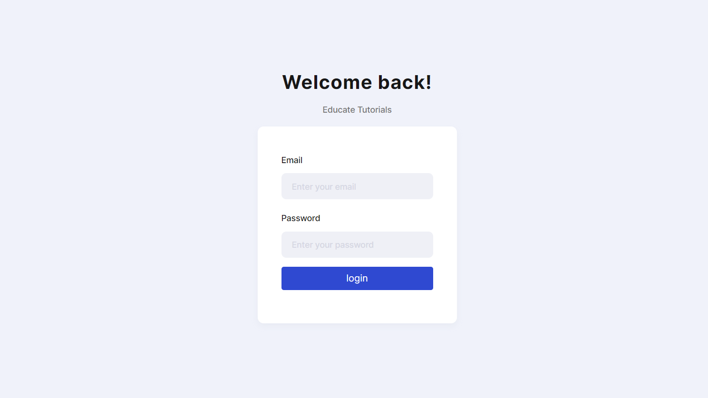
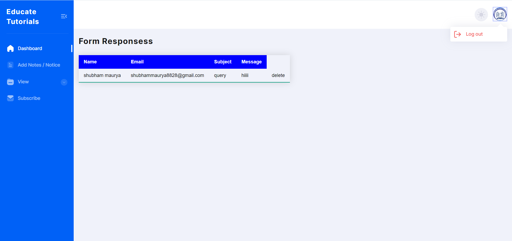
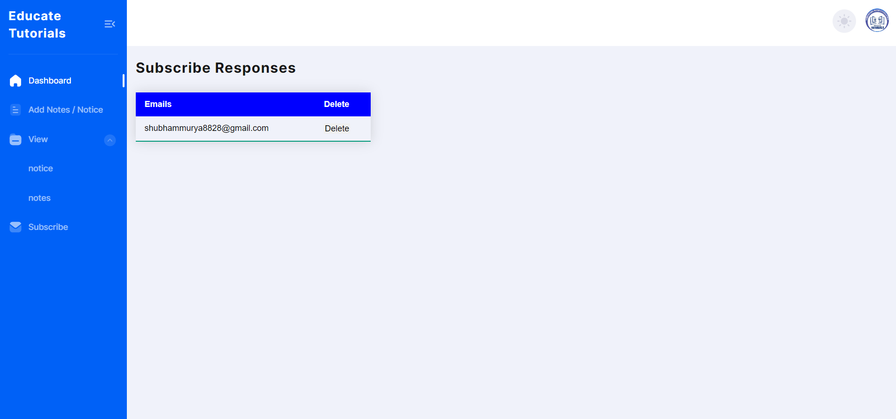
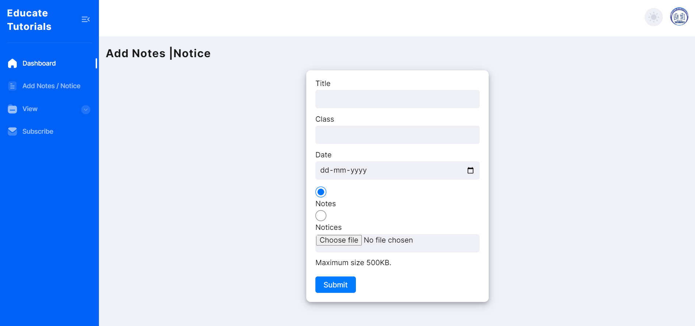

# Educate Tutorials WebApp

## I used php and mysql for backend 

### This  web project done in html,css ,js,bootstrap, php,mysql,

####  preview Link
 
 (https://educatetutorials.rf.gd)
 
### User Access and Authentication:

* Detail the login and authentication process for different user roles (students, staff, administrators).
* Explain security measures implemented to protect sensitive data.

### Dashboard Overview:

* Describe the main features available on the dashboard, providing a snapshot of key information.
* Include widgets or summaries that highlight important statistics, such as total enrolled students, staff count, etc.

### Student Management:

* Outline the procedures for adding, editing, and deleting student profiles.
* Explain how student data is organized and categorized.
* Include details on features like class enrollment, academic history tracking, and contact information.

### Staff Management:

* Describe the process of adding and managing staff profiles.
* Explain how staff roles and responsibilities are defined.
* Include information on staff contact details, qualifications, and assigned tasks.
* a good  ux/ui 

### Screenshot

* Overall Website

* Admin Login
 

* Admin Dashboard
 

* New letter Responses
 

* Add Notice / Notes

